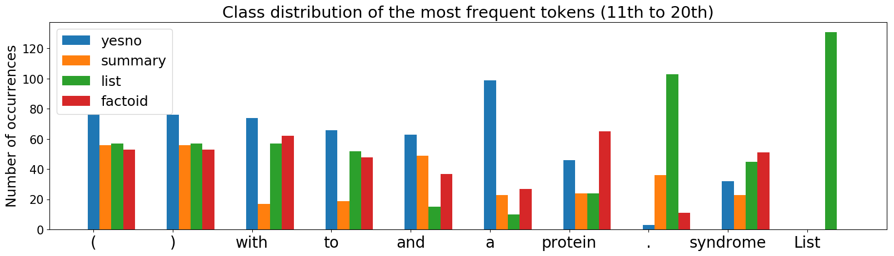
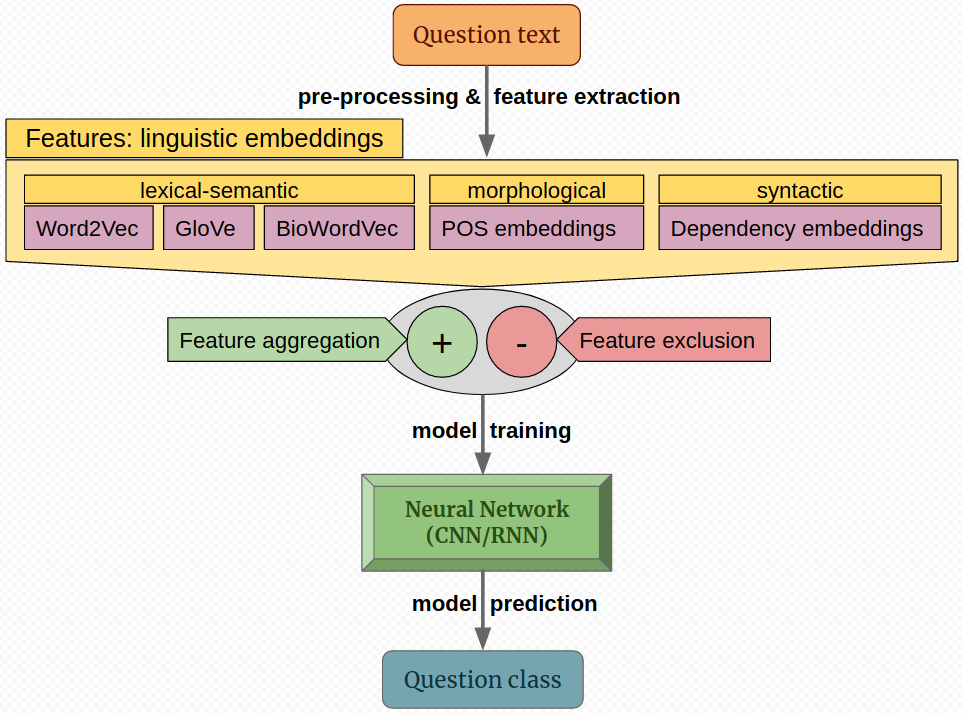
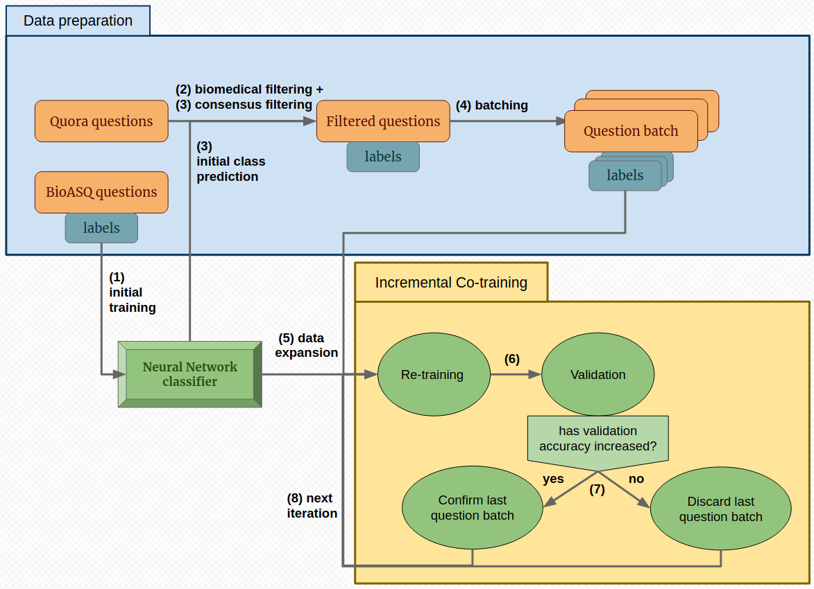

# Classification of Biomedical Questions from the BioASQ Challenge - Task 6b, adding co-training with Quora questions

## Introduction

According to its original formulation, the BioASQ Challenge - Task 6b is a Question-Answering competition in the biomedical domain. The organizers provided a set of questions, divided in two sets, training and test, with the latter being labeled with a specific question type (or class), as well as an answer. In this work two tasks are solved:

- Task 1: Development of a classifier of biomedical questions from the challenge, into 4 question types: factoid, summary, list and yes/no.

- Task 2: Co-training with an extensive broad-domain data set of 404K Quora question pairs to improve the classification accuracy, since the data of Task 1 is comprised only of a small number of questions (2252). Nevertheless, the Quora questions need to be filtered and classified first, before being usable in the model.

Many linguistic features are used in different models of the work, including word embeddings (Word2Vec, GloVe and BioWordVec), POS-tag embeddings and syntactic dependency embeddings.

| | |
|-|-|
| **Authors** | Albert Espín and Lavanya Mandadapu |
| **Date**  | October 2019 - January 2020  |
| **Code license**  | MIT |
| **Report license**  | Creative Commons Attribution, Non-Commercial, Non-Derivative |
| **Datasets license**  | Not owned by the authors of this work; "Questions.xslx" ([BioASQ](bioasq.org/participate/challenges_year_6)), "quora_duplicate_questions.tsv" ([Quora's Kaggle](https://www.kaggle.com/c/quora-question-pairs/data)) |


## Pre-requirements

Python 3.6 (or higher) must be installed in the running machine. Additionally, the following packages need to be installed:
- gensim (for word embeddings).
- keras (for Neural Networks).
- matplotlib (for plots).
- nltk (for NLP pre-processing).
- numpy (for numerical analysis).
- pandas (for tables).
- sklearn (for scientific/data models).

The "quora_duplicate_questions.tsv" in the "data" folder is contained in a zip, that should be extracted in the same folder. 


## Running instructions

The project code file is "main.py". It can be run in terminal ("python main.py", or alternative commands in some machines, such as "python3 main.py"). Alternatively it can be run in an IDE (e.g. PyCharm), opening the file and pressing the run button.


## Configuring the experiments
By default, Task 2 is executed. We can change the task to solve by changing the following boolean variable:

```python
task1 = False
```

By default, the CNN model with Word2Vec embeddings is used. Other features can be used by placing the “True” value in the desired option, and “False” in the rest (or “False” in all to use Word2Vec):

```python
use_glove = False
use_biowordvec = False
combine_embeddings = False
use_pos = False
combine_pos = False
use_triples = False
combine_triples = False
combine_pos_triples = False
```

While Word2Vec trains embeddings specifically for the BioASQ dataset, the other embeddings require additional files to work, which were not included due to their high size, but their links are provided next. They should be placed in the “data” folder:
- Glove embeddings:
  - File: “glove.twitter.27B.200d.txt”.
  - Link: http://nlp.stanford.edu/data/glove.twitter.27B.zip
- BioWordVec embeddings:
  - File: “bio_embedding_extrinsic”.
  - Link: https://github.com/ncbi-nlp/BioWordVec or https://figshare.com/articles/Improving_Biomedical_Word_Embeddings_with_Subword_Information_and_MeSH_Ontology/6882647
- Part Of Speech tag embeddings: no extra requirements.
- Syntactic tree embeddings: CoreNLP is required: http://nlp.stanford.edu/software/stanford-corenlp-full-2018-10-05.zip
  - Also, needs to run the server in terminal with a command such as the following, told in the
documentation: “java -mx4g -cp "*" edu.stanford.nlp.pipeline.StanfordCoreNLPServer -
port 9000 -timeout 15000”.

In order for embeddings to work properly, they need to be regenerated when switching from Task 1 to Task 2, or vice versa, because the embeddings are either built/fine-tuned in the original data only or additionally on Quora questions to. To do that, we need to temporarily replace the “if” statements that check for the existence of embedding matrices to make them false, and go to the “else” (rebuilding the matrix), for instance, for BioWordVec:

```python
if os.path.isfile(bio_matrix_path):
```

Change to the following line to force matrix rebuilding:

```python
if False:
```

The CNN architecture (that gave the best results), is used by default, because its layers (from Embeddings to Dense with 4-unit Softmax) are defined in the function “build_model_fixed”, called while training. Other architectures (GRU, LSTM, CNN-GRU, CNN-LSTM) can be found under “if” and ”elif” blocks of the “build_model”, which is not explicitly called.

Plots are saved in the “data” folder, especially in Task 1, if “show_plots” is assigned the “True” value. In Task 2, validation accuracy evolution plots are saved.The best results of previous runs, comprised by classification reports with per-class and global precision, recall and F1 metrics, can be found in “Task1_BestResults.txt” and “Task2_BestResults.txt”, but are better structured and synthesized in the report.


## Plots and diagrams





